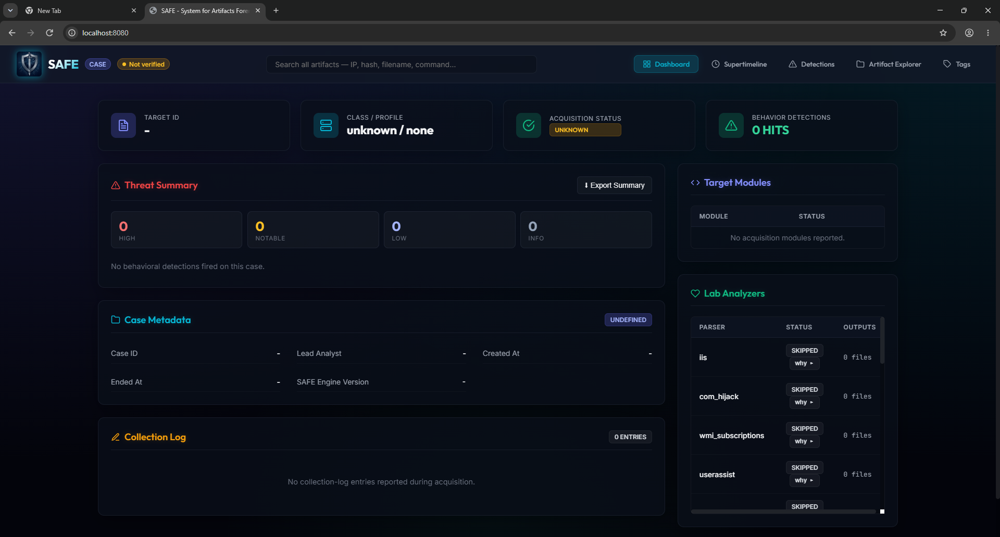

<p align="center">
  
</p>

# SAFE (سيف)

**System for Artifacts Forensic and Examination**  
*Created by Salah Alzahrani*


**SAFE** is a high-performance Windows incident-response forensic tool designed for rapid, reliable evidence collection and deep offline analysis. Built entirely in Go, it compiles into statically linked, zero-dependency binaries that minimize operational footprint and ensure maximum OPSEC on compromised endpoints.

SAFE is purpose-built for Incident Responders who need reliable access to locked system files, secure evidence handling during acquisition, and the ability to parse millions of artifacts directly into a highly responsive local reporting dashboard.

---

## 🎯 Key Features for Incident Responders

* **Live Acquisition via VSS:** SAFE automatically provisions a temporary Volume Shadow Copy (VSS) to acquire locked system files (e.g., `SAM`, `SYSTEM`, `Amcache.hve`, `$MFT`, and live `EVTX` logs) directly from the shadow securely and reliably.
* **Secure Payload Collection:** Suspected webshells and binaries are collected straight from the VSS into an encrypted container (`web_payloads.zip` via ZipCrypto with password `infected`). This ensures the integrity of the evidence is maintained and prevents premature alteration by local security controls during the acquisition phase.
* **Zero Dependency Parsing:** Analyzes `$MFT`, `$J` (USN Journal), `EVTX`, Prefetch, ShimCache, ShellBags, and Browser SQLite databases entirely in-memory using native Go libraries. **No Python scripts or external runtime wrappers are required.**
* **High-Performance HTML Dashboard:** The analyzer spins up a self-contained local web server. It uses server-side pagination to render **million-row Plaso-compatible timelines** and 800,000+ row MFT dumps with zero browser lag.
* **Built-in Behavioral Engine:** Automatically evaluates parsed artifacts against a suite of offline behavioral rules (e.g., UAC Bypass, Suspicious PowerShell, IIS Webshell activity) and injects `ALERT` tags directly into the timeline.
* **Tamper-Evident Chain of Custody:** Every acquired file is SHA-256 hashed on the endpoint, rolling up into a cryptographic `manifest.json` that ensures absolute integrity before analysis begins in the lab.

---

## 🏗️ Architecture

SAFE enforces strict separation between collection and analysis. **The target endpoint never parses its own data**, ensuring minimal footprint and preventing premature EDR alarms.

1. **`safe-collect.exe` (Target Endpoint):** The lightweight acquisition utility. Run as Administrator from a USB or network share, it captures volatile state (process memory, network connections) and disk artifacts, writing them into an integrity-sealed case folder.
2. **`safe-analyze.exe` (Lab Workstation):** The offline analysis framework. Run from a macOS, Linux, or Windows analysis machine, it parses the case folder, runs threat inspections, and opens the analyst dashboard.

---

## 🚀 Quick Start

<p align="center">
  
</p>

### 1. Acquisition (Target Endpoint)
Run `safe-collect.exe` as Administrator on the compromised machine.

**Interactive TUI Mode (Recommended):**
```cmd
.\safe-collect.exe --tui
```

**Headless CLI Mode:**
```cmd
.\safe-collect.exe --case INC-2026-0618 --analyst SA --target CLIENT-WS-01 --profile rapid_triage --output D:\CaseData
```

*Available profiles: `rapid_triage` (~30s), `endpoint_deep` (~1.5m), and `memory_triage`.*

### 2. Lab Analysis (Analyst Workstation)
Transfer the securely hashed case folder to your analysis workstation and run the analyzer.

```cmd
# Analyze the case and automatically launch the HTML Dashboard
.\safe-analyze.exe CASE-INC-2026-0618_20260618-120000
```
*If the case was previously analyzed, this command instantly launches the dashboard.*

### 3. Case Integrity Verification
At any time during the investigation, you can mathematically prove the case folder has not been tampered with:
```cmd
.\safe-analyze.exe --verify CASE-INC-2026-0618_20260618-120000
```

---

## 🛠️ Build Workflow

Standard compilation and cross-compilation are handled natively. Ensure you have Go 1.22+ installed.

```cmd
# Build the analyzer for your current OS
go build -o safe-analyze.exe ./cmd/safe-analyze

# Build the collection binary for the Windows target
go build -o safe-collect.exe ./cmd/safe-collect
```

---

## 📚 Documentation

For complete reference on collection profiles, STIX 2.1 ingestion, and how to write custom behavioral detection rules, please see the `docs/` directory:
- [Architecture & Design Rules](docs/ARCHITECTURE.md)
- [Detection Rules Syntax](docs/DETECTION_RULES.md)
- [Collection Profiles](docs/PROFILES.md)
- [Modules Reference](docs/MODULES_REFERENCE.md)

## ⚖️ License & Contributing

SAFE is open-source software licensed under the **Apache License 2.0**. See the [LICENSE](LICENSE) file for details.

We welcome pull requests and issue reports from the DFIR community! Please review [CONTRIBUTING.md](CONTRIBUTING.md) and [SECURITY.md](SECURITY.md) before submitting code or vulnerability reports.
